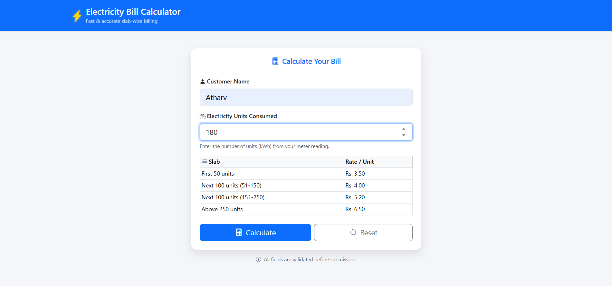
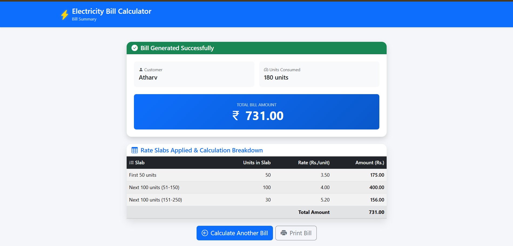

# Electricity Bill Calculator

A responsive Java web application developed using JSP, Jakarta Servlet, Apache Tomcat, Maven, Bootstrap, and jQuery to calculate electricity bills based on slab-wise tariff rates. The application validates user input, performs slab-wise bill calculation, displays a detailed bill breakdown, and allows users to download the generated bill as a PDF.

---

## Application Preview

### Home Page

<p align="center">
  
</p>

### Calculated Bill

<p align="center">
  
</p>

### Downloaded Bill (PDF)

<p align="center">
  
</p>

---

## Features

- Responsive user interface using Bootstrap 5
- Client-side validation using jQuery
- Server-side validation using Jakarta Servlet
- Slab-wise electricity bill calculation
- Detailed bill breakdown for each tariff slab
- PDF bill generation and download
- Clean and user-friendly interface

---

## Electricity Tariff

| Unit Range | Rate |
|------------|------|
| First 50 Units | ₹3.50 per unit |
| Next 100 Units (51–150) | ₹4.00 per unit |
| Next 100 Units (151–250) | ₹5.20 per unit |
| Above 250 Units | ₹6.50 per unit |

---

## Technologies Used

### Frontend
- HTML5
- CSS3
- Bootstrap 5
- JavaScript
- jQuery
- JSP

### Backend
- Java (JDK 24)
- Jakarta Servlet 6.0

### Build Tool
- Apache Maven 3.9.16

### Server
- Apache Tomcat 10.1.57

### Development Environment
- Visual Studio Code
- Git

---

## Project Structure

```text
ElectricityBillCalculator
│
├── screenshots/
│   ├── home-page.png
│   ├── calculated-bill.png
│   └── bill-pdf.png
│
├── src/
│   └── main/
│       ├── java/
│       ├── resources/
│       └── webapp/
│           ├── css/
│           ├── js/
│           ├── index.jsp
│           ├── result.jsp
│           └── WEB-INF/
│               └── web.xml
│
├── pom.xml
├── README.md
└── target/
```

---

## Prerequisites

- Oracle JDK 24
- Apache Maven 3.9.16
- Apache Tomcat 10.1.57
- Visual Studio Code

---

## Installation

Clone the repository:

```bash
git clone https://github.com/YOUR_USERNAME/ElectricityBillCalculator.git
```

Navigate to the project directory:

```bash
cd ElectricityBillCalculator
```

Build the project:

```bash
mvn clean package
```

Copy the generated WAR file from:

```text
target/ElectricityBillCalculator.war
```

to:

```text
apache-tomcat-10.1.57/webapps/
```

Start Apache Tomcat and open:

```text
http://localhost:8080/ElectricityBillCalculator/
```

---

## Author

Atharv Dubal

B.Tech Computer Engineering

Vishwakarma Institute of Technology, Pune